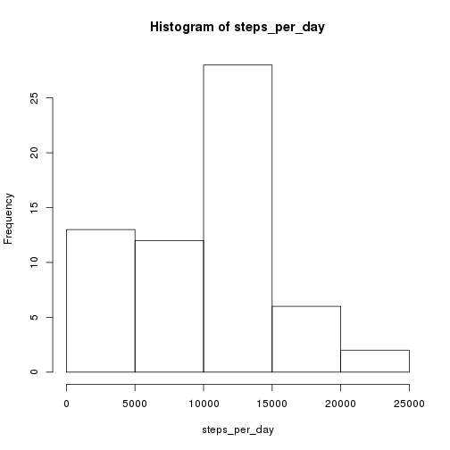

## Loading and preprocessing the data
The first task is to read in the data from `activity.zip`.


```r
# Unzip and read the data.
unzip('activity.zip')
data <- read.csv('activity.csv')
head(data)
```

```
##   steps       date interval
## 1    NA 2012-10-01        0
## 2    NA 2012-10-01        5
## 3    NA 2012-10-01       10
## 4    NA 2012-10-01       15
## 5    NA 2012-10-01       20
## 6    NA 2012-10-01       25
```

Next, modify the data into a format I feel more comfortable with.
The `interval` column is a 24hr time, I prepend enough `0`s so that they all have a length of 4.
I then add a `time` column to the data which will be of the type `POSIXct`, this will store the `date` and `interval` all in one data structure, these two columns are then removed because they are now superfluous.

Even though my work might have been easier later on in the analysis without replacing these columns with a single column, I feel that this better reflects the data being used.
I then display 5 rows to show the new structure.


```r
# Make all the times length 4 by adding enough 0s to the start.
data$interval <- formatC(as.integer(data$interval), width="4", flag="0")
# Use the `date' and `interval' columns to make a `time' column to replace both.
# The as.POSIXct is needed so that dplyr doesn't complain later.
data$time <- as.POSIXct(strptime(paste(data$date, data$interval), format="%Y-%m-%d %H%M"))
data <- data[,!(names(data) %in% c('date', 'interval'))]
data[4145:4150,]
```

```
##      steps                time
## 4145   127 2012-10-15 09:20:00
## 4146    21 2012-10-15 09:25:00
## 4147    35 2012-10-15 09:30:00
## 4148     0 2012-10-15 09:35:00
## 4149     0 2012-10-15 09:40:00
## 4150    78 2012-10-15 09:45:00
```


## What is mean total number of steps taken per day?
The task of this section is to see how the subject's days varied.
To do this we need to add up the total number of steps taken each day.
Using the `tapply` function, we `sum` up the number of steps, grouped by the day they were recorded.
Of course, remember to remove `NA` values.


```r
steps_per_day <- tapply(data$steps,
                        as.character(data$time, format="%Y-%m-%d"),
                        sum,
                        na.rm=TRUE)
```

Now consider the frequency of the number of steps taken per day in the form of a histogram.


```r
hist(steps_per_day)
```

 

This shows that the subject most often took between `10 000` and `15 000` steps per day.
The subject rarely took more than `15 000` steps, whereas they somewhat regularly took less than `10 000`.
With the less than `10 000`s, I suppose we should concern ourselves with the role that `NA` values may play in that.

Looking at the mean and median of this data:


```r
mean(steps_per_day)
```

```
## [1] 9354.23
```

```r
median(steps_per_day)
```

```
## [1] 10395
```

Shows that both are around `10 000`, which seems to sit right with what the histogram was showing us.

## What is the average daily activity pattern?
Having looked at how the total number of steps per day varies, we now turn our attention to how the subject's activity varies throughout the day.
This is where I am totes happy about how I messed with the dates earlier, as the only changes needed to go from `steps_per_day` to `steps_per_int` were to change the `format=` bit and replace `sum` with `mean`.
Sure, you may point out that it was just as easy to do this without messing with the dates, and you may be right, but please just let me have this little win.
Oh yeah, then throw up a line plot of the mean activity per interval, again, forget the `NA` values.


```r
steps_per_int <- tapply(data$steps,
                        as.character(data$time, format="%H%M"),
                        mean,
                        na.rm=TRUE)
plot(as.integer(names(steps_per_int)), steps_per_int, type='l',
     xlab="Time",
     ylab="Steps")
```

 

Man, look at that spike around 9AM, going to work much?

Checking the time that the maximum number of steps takes place,


```r
names(steps_per_int)[which.max(steps_per_int)]
```

```
## [1] "0835"
```

indeed seems to confirm that the answer is: yes, going to work much.


## Imputing missing values
As hinted earlier, the `NA` values may in fact be a problem.
Perhaps I was psychic, or, as is probably more likely, I had already looked ahead and seen what was coming.
We want to replace the `NA` values with something which will hopefully 'unskew' our results.
Check this out:


```r
nas <- sum(is.na(data$steps))
nas
```

```
## [1] 2304
```

```r
nas / length(data$steps)
```

```
## [1] 0.1311475
```

This means that just over 13% of our intervals were `NA`!

In order to remove the skew from the analysis, I replace each `NA` with the mean number of steps taken during that interval over *all* days.
The reason for choosing this method is that the number of steps should vary more with the time of day over changing days.
For example, if I replaced the `NA` values with the mean or median of the steps taken that day, we would get high results for steps taken at 3AM, whereas the subject was probably sleeping at 3AM.
The only thing I'm assuming here is that there is no `interval` which has an `NA` value for every day, I will show this is a legit assumption to make in a bit.


```r
# Check out how the data looks before we `fix' it.
head(data)
```

```
##   steps                time
## 1    NA 2012-10-01 00:00:00
## 2    NA 2012-10-01 00:05:00
## 3    NA 2012-10-01 00:10:00
## 4    NA 2012-10-01 00:15:00
## 5    NA 2012-10-01 00:20:00
## 6    NA 2012-10-01 00:25:00
```

```r
# Get a list of all the intervals.
ints <- as.character(data$time, format="%H%M")
# Get a boolean vector for which steps are NA.
is_na <- is.na(data$steps)
# We want to cycle through all the intervals.
for (i in unique(ints)) {
  # Get a boolean vector which tells us which observations took place for
  # the current interval.
  this_int <- ints == i
  # This is the `check that there is at least one not NA for this interval'.
  if (sum(this_int & !is_na) > 0) {
    # Take the mean of all the obvervations that aren't NA in this interval.
    m <- as.integer(mean(data$steps[this_int], na.rm=TRUE))
    # Set all of the NA values for this interval to the calculated mean.
    data$steps[this_int & is_na] <- m
  }
}

# Check out all of these not NAs now!
head(data)
```

```
##   steps                time
## 1     1 2012-10-01 00:00:00
## 2     0 2012-10-01 00:05:00
## 3     0 2012-10-01 00:10:00
## 4     0 2012-10-01 00:15:00
## 5     0 2012-10-01 00:20:00
## 6     2 2012-10-01 00:25:00
```

The following is to check that all of the `NA` observations have been removed.
This will *not* be zero if there was an interval which had `NA` for every day.


```r
sum(is.na(data$steps))
```

```
## [1] 0
```

Ah, it is zero.
Crisis averted.

Now check out the new distribution of steps per day taken.


```r
steps_per_day_imp <- tapply(data$steps,
                        as.character(data$time, format="%Y-%m-%d"),
                        sum,
                        na.rm=TRUE)

hist(steps_per_day_imp)
```

 

That looks a bit more centred.
Those `NA` results were indeed skewing the results.
Again, the question must be asked...
Psychic?

Consider the new mean and median:


```r
mean(steps_per_day_imp)
```

```
## [1] 10749.77
```

```r
median(steps_per_day_imp)
```

```
## [1] 10641
```

As expected, both have increased, and the mean is now larger than the median.

## Are there differences in activity patterns between weekdays and weekends?
Now we'll look at how activity is different depending on whether it was a weekday or a weekend.
We should expect that the 'work much?' peak which I pointed out before will appear in a weekday plot, but not in the weekend plot.
The weekend plot should be a lot more spread out.


```r
library(lattice)
library(dplyr)
```

```r
# Could have done a `weekday' vector, but there's too many days there.
weekend <- weekdays(data$time) %in% c("Saturday", "Sunday")
# This might be a bit of a round-about way to get there.
# First add a column which is true for a weekday and false for weekend.
data$weekday <- !weekend
# So that the plot is labelled good, change true and false to 'weekday'
# and 'weekend' respectively.
data$weekday[weekend] <- 'weekend'
data$weekday[!weekend] <- 'weekday'

# Use dplyr to take the mean when grouped by both interval and weekday.
by_we <- (data %>%
          group_by(time=as.character(time, format="%H%M"), weekday) %>%
          summarise(steps=mean(steps))
         )

# Plot with frames by weekday.
xyplot(steps ~ as.integer(time) | weekday, data=by_we, type='l', xlab='Time')
```

 

As we can see from the plots, the weekday seems to still have the huge spike just before 9AM.
The weekend plot is a lot more spread out.
The lack of a second spike at the end of the day for weekdays could be due to having a hard start time of 9AM for work, but having a soft end of day time.
There is a second spike there, but not as sharp as the 'going to work much' spike.

## Epilogue
Dear reader, I should probably apologise for how chilaxed I became as I got further through writing up this report.
I started writing with coffee in hand, but then things got out of hand.
If you look closely, you can probably pick the point where the caffeine kicked in.
I hope you enjoyed reading this as much as I enjoyed typing it.
Catch ya.
